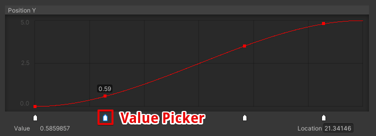
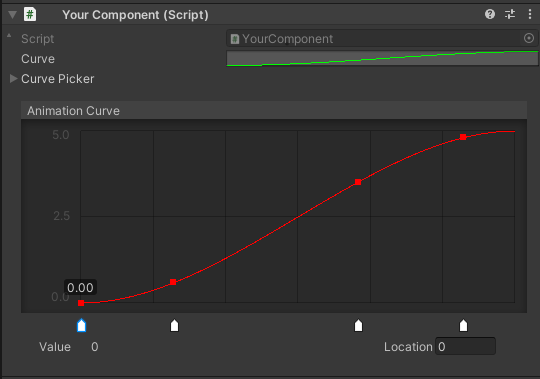

# CurvePicker
<b>CurvePicker<b> is a tool for sampling AnimationCurves using a value picker. <br>
You can get the value of the AnimationCurve at the picker's position.


<br>
<br>

# Requirement
- Unity 2019.4.15f1 or higher
<br>
<br>

# Drawing CurvePicker
Create public ```AnimationCurve``` and ```CurvePicker``` in your class.

```cs
public class YourComponent : MonoBehaviour
{
    [SerializeField] 
    private AnimationCurve curve 
        = new AnimationCurve(new Keyframe(0f, 0f), new Keyframe(1f, 5f));
    [SerializeField] 
    private CurvePicker curvePicker 
        = new CurvePicker(4);

    public CurvePicker CurvePicker => curvePicker;
    public AnimationCurve Curve => curve;
}
```

<br>
Write editor script as the following.

```cs
namespace CurvePickerTool.Samples
{
    using System.Collections.Generic;
    using UnityEditor;
    using UnityEngine;

    [CustomEditor(typeof(YourComponent))]
    public class YourComponentInspector : Editor
    {
        private CurveComponent component;
        private CurvePickerGUI curveGUI;

        private void OnEnable()
        {
            component = target as CurveComponent;
            curveGUI = new CurvePickerGUI();
            curveGUI.SetListenerChangeSwatch(OnDragSwatch);
            component.CurvePicker.DoSample(component.Curve);
        }

        public override void OnInspectorGUI()
        {
            EditorGUI.BeginChangeCheck();
            base.OnInspectorGUI();
            if (EditorGUI.EndChangeCheck())
            {
                component.CurvePicker.DoSample(component.Curve);
                curveGUI.BuildSwatch(component.CurvePicker);
                Repaint();
            }

            curveGUI.OnGUI("Animation Curve", component.Curve, component.CurvePicker);
        }

        private void OnDragSwatch(List<SwatchEditor.Swatch> list)
        {
            RebuildPicker(component.CurvePicker, component.Curve, list);
            EditorUtility.SetDirty(component);
        }

        private void RebuildPicker(CurvePicker curvePicker, AnimationCurve curve, List<SwatchEditor.Swatch> list)
        {
            for (int i = 0; i < curvePicker.Count; i++)
            {
                curvePicker.SetSamplePoint(i, list[i].time);
            }
            curvePicker.DoSample(curve); // GUI更新
        }
    }
}
```
<br>

Then an AnimationCurve with a value picker will be drawn.

<br>

<br>

# Getting value

You can get the picker's value using ```CurvePicker.GetSampleValue()```.

```cs
for (int i = 0; i < curvePicker.Count; i++)
{
    float value = curvePicker.GetSampleValue(i);
}
```